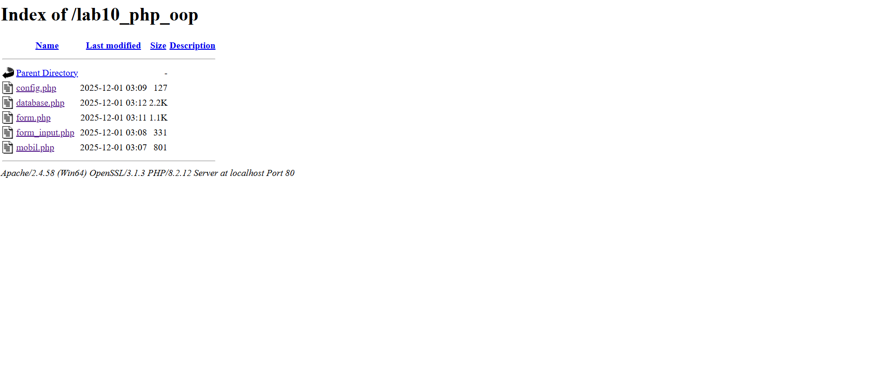

# lab10web
# Haikal Lukman Nur Hakim
# 312410142
# TI.24.A1

1. Tujuan Praktikum

Praktikum ini bertujuan agar mahasiswa:

Memahami konsep dasar Object-Oriented Programming (OOP).

Mengerti konsep class dan object pada PHP.

Mampu membuat program OOP sederhana menggunakan PHP.

Menerapkan modularisasi menggunakan class library seperti Form dan Database.

2. Langkah Kerja Praktikum
2.1. Persiapan Project

Buat folder baru pada webserver (XAMPP/htdocs):

htdocs/lab10_php_oop/

3. Praktikum OOP – Program Mobil
3.1. File: mobil.php

Program ini membuat class Mobil dengan property dan method, kemudian membuat dua objek berbeda.

Kode Program
<?php
class Mobil
{
    private $warna;
    private $merk;
    private $harga;

    public function __construct()
    {
        $this->warna = "Biru";
        $this->merk = "BMW";
        $this->harga = "10000000";
    }

    public function gantiWarna($warnaBaru)
    {
        $this->warna = $warnaBaru;
    }

    public function tampilWarna()
    {
        echo "Warna mobilnya : " . $this->warna;
    }
}

$a = new Mobil();
$b = new Mobil();

echo "<b>Mobil pertama</b> ";
$a->tampilWarna();
echo " Mobil pertama ganti warna ";
$a->gantiWarna("Merah");
$a->tampilWarna();

echo " <b>Mobil kedua</b> ";
$b->gantiWarna("Hijau");
$b->tampilWarna();
?>

4. Class Library — Form
4.1. File: form.php

Class library ini digunakan untuk membuat form input secara dinamis.

Kode Program
<?php
class Form
{
    private $fields = array();
    private $action;
    private $submit = "Submit Form";
    private $jumField = 0;

    public function __construct($action, $submit)
    {
        $this->action = $action;
        $this->submit = $submit;
    }

    public function displayForm()
    {
        echo "<form action='".$this->action."' method='POST'>";
        echo '<table width="100%" border="0">';

        for ($j=0; $j < count($this->fields); $j++) {
            echo "<tr><td align='right'>".$this->fields[$j]['label']."</td>";
            echo "<td><input type='text' name='".$this->fields[$j]['name']."'></td></tr>";
        }

        echo "<tr><td colspan='2'>";
        echo "<input type='submit' value='".$this->submit."'></td></tr>";
        echo "</table>";
    }

    public function addField($name, $label)
    {
        $this->fields [$this->jumField]['name'] = $name;
        $this->fields [$this->jumField]['label'] = $label;
        $this->jumField++;
    }
}
?>

5. Implementasi Form Library
5.1. File: form_input.php

File ini meng-include form.php dan membuat form input sederhana.

Kode Program
<?php
include "form.php";

echo "<html><head><title>Mahasiswa</title></head><body>";

$form = new Form("", "Input Form");
$form->addField("txtnim", "Nim");
$form->addField("txtnama", "Nama");
$form->addField("txtalamat", "Alamat");

echo "<h3>Silahkan isi form berikut ini :</h3>";

$form->displayForm();

echo "</body></html>";
?>

6. Class Library — Database Connection
6.1. File: config.php

Konfigurasi database.

<?php
$config = [
  'host' => 'localhost',
  'username' => 'root',
  'password' => '',
  'db_name' => 'latihan_oop'
];
?>

6.2. File: database.php

Class ini berfungsi untuk:

koneksi database

insert

update

delete

get data

Kode Program
<?php
class Database {
    protected $host;
    protected $user;
    protected $password;
    protected $db_name;
    protected $conn;

    public function __construct() {
        $this->getConfig();
        $this->conn = new mysqli($this->host, $this->user, $this->password, $this->db_name);

        if ($this->conn->connect_error) {
            die("Connection failed: " . $this->conn->connect_error);
        }
    }

    private function getConfig() {
        include_once("config.php");
        $this->host = $config['host'];
        $this->user = $config['username'];
        $this->password = $config['password'];
        $this->db_name = $config['db_name'];
    }

    public function query($sql) {
        return $this->conn->query($sql);
    }

    public function get($table, $where = null) {
        if ($where) {
            $where = " WHERE ".$where;
        }
        $sql = "SELECT * FROM $table $where";
        $result = $this->conn->query($sql);
        return $result->fetch_assoc();
    }

    public function insert($table, $data) {
        foreach($data as $key => $val) {
            $column[] = $key;
            $value[] = "'$val'";
        }

        $columns = implode(",", $column);
        $values = implode(",", $value);

        $sql = "INSERT INTO $table ($columns) VALUES ($values)";
        return $this->conn->query($sql);
    }

    public function update($table, $data, $where) {
        foreach ($data as $key => $val) {
            $update_value[] = "$key='$val'";
        }

        $update_value = implode(",", $update_value);
        $sql = "UPDATE $table SET $update_value WHERE $where";

        return $this->conn->query($sql);
    }

    public function delete($table, $filter) {
        $sql = "DELETE FROM $table $filter";
        return $this->conn->query($sql);
    }
}
?>

7. Implementasi Modularisasi (Tugas)
7.1. File: input_mahasiswa.php

Form yang terhubung ke database menggunakan class library.

Kode Program
<?php
include "form.php";
include "database.php";

$db = new Database();

if ($_POST) {
    $data = [
        'nim' => $_POST['txtnim'],
        'nama' => $_POST['txtnama'],
        'alamat' => $_POST['txtalamat']
    ];

    $insert = $db->insert("mahasiswa", $data);

    if ($insert) {
        echo "Data berhasil disimpan!  ";
    } else {
        echo "Gagal menyimpan data!  ";
    }
}

$form = new Form("input_mahasiswa.php", "Simpan");
$form->addField("txtnim", "NIM");
$form->addField("txtnama", "Nama");
$form->addField("txtalamat", "Alamat");

echo "<h2>Form Input Mahasiswa</h2>";
$form->displayForm();
?>

📸 Screenshot form & hasil insert ke database

8. Kesimpulan

Pada praktikum ini, mahasiswa telah mempelajari:

Konsep OOP: class, object, property, method.

Constructor dan enkapsulasi.

Membuat class library (Form & Database).

Menggunakan modularisasi dengan include.
